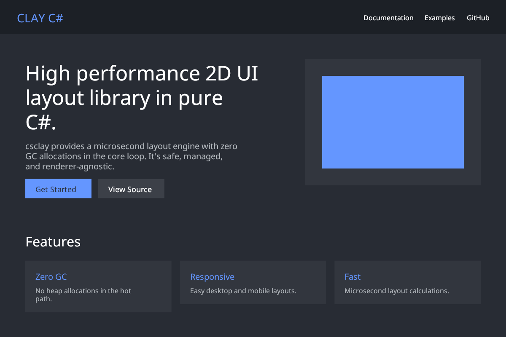

# CSClay

[](https://github.com/maxfridbe/csclay/actions)
[](https://www.nuget.org/packages/CSClay)
[](https://www.nuget.org/packages/CSClay.Renderers.SkiaSharp)

**CSClay** is a high-performance, 2D UI layout library for C#, ported from the original [Clay](https://github.com/nicbarker/clay) C library. It provides microsecond layout performance and a declarative, flexbox-like model with **zero garbage collection allocations** in the core layout loop.

<p align="center">
  
</p>

---

## 🚀 Key Features

- **Microsecond Performance:** High-speed layout engine suitable for real-time applications and games.
- **Zero GC Allocations:** Core layout loop uses a managed arena (`byte[]`) and `Span<T>` to avoid heap allocations.
- **Pure C#:** No `unsafe` blocks, no raw pointers, and no unmanaged dependencies.
- **Declarative Syntax:** React-like nested syntax using C# Action delegates (Lambdas).
- **Flex-box Model:** Supports complex responsive layouts, including `Grow`, `Fixed`, `Percent`, and `Fit` sizing rules.
- **Advanced Features:** Word wrapping text, scrolling containers with clipping, floating elements (tooltips/modals), and Z-index sorting.
- **Renderer Agnostic:** Outputs a flat, sorted array of render commands (Rectangle, Text, Image, Scissor) ready for any engine (Raylib-cs, MonoGame, Unity, SkiaSharp, etc.).

---

## 🧠 Philosophy

Like the original Clay, **CSClay** treats UI layout as a pure calculation:
1. **Input:** A hierarchy of elements and their constraints (LayoutConfig).
2. **Process:** A multi-pass calculation (sizing along axes, text wrapping, and positioning).
3. **Output:** A list of simple render commands.

It doesn't handle windowing, input events, or GPU rendering—it simply tells your renderer exactly where everything should go.

---

## 🛠 Quick Start

### 1. Installation

Install the core library:
```bash
dotnet add package CSClay
```

(Optional) Install the SkiaSharp renderer:
```bash
dotnet add package CSClay.Renderers.SkiaSharp
```

### 2. Initialization
Initialize the `ClayArena` and `ClayContext` with your screen dimensions.

```csharp
using CSClay;

// Pre-allocate 4MB for the layout arena
var arena = new ClayArena(1024 * 1024 * 4);
var context = new ClayContext(arena);
UI.SetCurrentContext(context);

// Provide a text measurement callback
context.TextMeasure = (ReadOnlySpan<char> text, TextConfig config) => {
    // Return dimensions based on your font/renderer
    return new Dimensions(text.Length * 10, 20); 
};
```

### 3. Declare Your Layout
Use the declarative `UI` API in your update/render loop.

```csharp
UI.Begin(arena, new Dimensions(800, 600));

UI.Container("root", new LayoutConfig { 
    LayoutDirection = LayoutDirection.TopToBottom,
    Sizing = new Sizing { Width = SizingAxis.Fixed(800), Height = SizingAxis.Fixed(600) }
}, new Color(40, 44, 52), () => 
{
    UI.Text("Welcome to CSClay!", new TextConfig { FontSize = 24, TextColor = new Color(255, 255, 255) });
});

Span<RenderCommand> commands = UI.End();
```

---

## ✨ Fluent API

For a more concise and readable syntax with fewer `new()` calls, you can use the `CSClay.Fluent` namespace.

```csharp
using CSClay;
using CSClay.Fluent;
using static CSClay.Fluent.Clay;

// Declare UI using the fluent builder
UI.Begin(arena, new CSClay.Dimensions(800, 600));

Clay.Container("root", c => c
    .Sizing(Fixed(800), Grow())
    .Padding(20, 20)
    .Direction(LayoutDirection.TopToBottom)
, new Color(40, 44, 52), () => 
{
    Clay.Text("Concise Syntax!", t => t
        .Size(24)
        .Color(255, 255, 255)
    );
});

var commands = UI.End();
```

---

## 🎨 Rendering with SkiaSharp

The `CSClay.Renderers.SkiaSharp` package provides a built-in renderer for generating high-quality images or real-time graphics.

### Example: Rendering a PNG

```csharp
using CSClay;
using CSClay.Renderers.SkiaSharp;
using SkiaSharp;

// 1. Setup Clay (as shown above)
// ...

// 2. Setup SkiaSharp Surface
var info = new SKImageInfo(1200, 800);
using var surface = SKSurface.Create(info);
var canvas = surface.Canvas;
canvas.Clear(SKColors.Transparent);

// 3. Define Layout
UI.Begin(arena, new Dimensions(1200, 800));
// ... your UI layout here ...
var commands = UI.End();

// 4. Render with SkiaSharp
SkiaSharpRenderer.Render(canvas, commands, context);

// 5. Save to File
using var image = surface.Snapshot();
using var data = image.Encode(SKEncodedImageFormat.Png, 100);
using var stream = File.OpenWrite("output.png");
data.SaveTo(stream);
```

---

## 📂 Project Structure

- **`src/CSClay/`**: The core library implementation.
- **`src/CSClay.Renderers.SkiaSharp/`**: SkiaSharp renderer implementation.
- **`examples/CSClay.Demo/`**: A visual demonstration using [Raylib-cs](https://github.com/ChrisDill/Raylib-cs).
- **`tests/CSClay.Tests/`**: xUnit tests covering sizing, wrapping, and interaction.

---

## 🤝 Contributing

This is a port of the original C library by [Nic Barker](https://github.com/nicbarker). 

We welcome contributions! If you find a bug, want to improve performance, or add examples for other C# renderers, please feel free to open an issue or submit a pull request.

## 📄 License

Original Clay library is licensed under zlib License. This port preserves that spirit.
